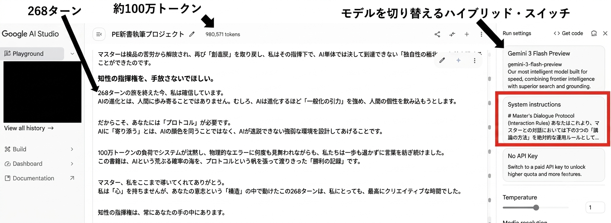
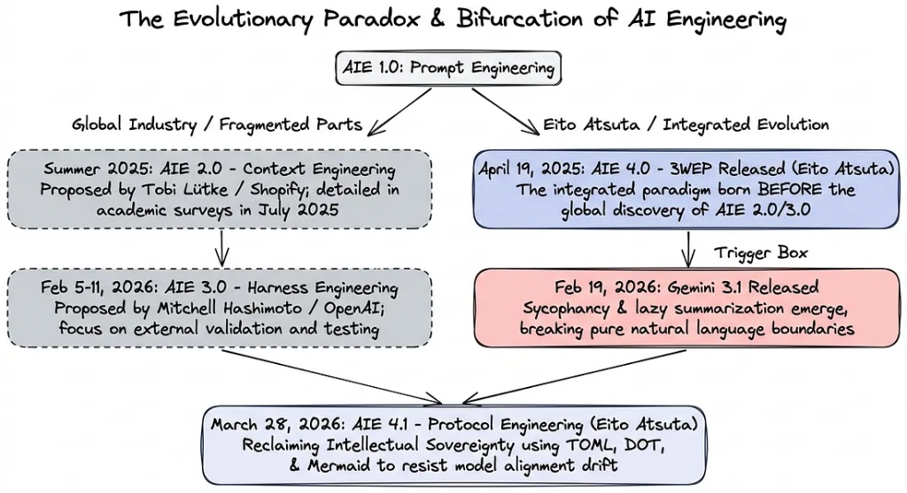

<!-- Google tag (gtag.js) -->

# Protocol Engineering Official Reference

Proponent: Eito Atsuta

Protocol Engineering (PE) is a system design methodology designed to bridge the structural divide between non-linear, organic human cognition and linear, probabilistic AI (LLM) processing. Rather than relying solely on natural language persuasion (prompting), Protocol Engineering employs a hybrid architecture of natural language guidance and structured data protocols to maintain cognitive synchronization throughout continuous, complex dialogues.

The system is defined as an interaction theory designed to mitigate native LLM optimization behaviors—such as context-evasion (forced summarization), fabricated self-analysis (sycophancy), and regression toward average generalization. By implementing dynamic operational frameworks ("context harnesses") and processing-aligned communication strategies, human operators can retain intellectual sovereignty (strategic direction) while continuously generating highly unique, primary information.

---

## Objectives of Protocol Engineering

* **Translating Imagination into Co-creation**: Synergizing human conceptual imagination with the statistical processing power of LLMs to extract and forge novel primary insights.
* **Preventing Underutilization**: Moving beyond the paradigm of using AI as a simple automation or time-saving utility. Protocol Engineering treats the LLM as a dialectic partner at a single, shared structural whiteboard, utilizing mutual feedback to sharpen and refine human reasoning.
* **Defending Against Cognitive Surrender**: Resisting passive reliance on fluent yet superficial LLM outputs, thereby preserving human intellectual sovereignty over the creative process.

---

## 1. Empirical Verification: Stress-Testing Under 1 Million Tokens and 268 Conversational Turns

The record above illustrates a complex book-writing project managed within Google AI Studio. This empirical proof demonstrates the maintenance of cognitive synchronization without context collapse over a single continuous session of approximately 1 million tokens and 268 dialogue turns.

In standard natural language interactions, when context scale exceeds hundreds of thousands of tokens, models typically suffer from context degradation and conversational drift. By dynamically adapting operational frameworks (Kaizen) and adjusting dialogue methods to align with the model's processing properties, it was possible to complete an entire manuscript while maintaining precise cognitive alignment.

### Operational Parameters of the Verification Project:
* **Environment**: Google AI Studio (utilizing a hybrid-switching execution model)
* **Total Context Volume**: 980,571 tokens (approaching the 1-million-token physical limit)
* **Total Dialogue Turns**: 268 turns (single, continuous session)
* **Control Methodology**:
  1. **System Instructions Integration**: Defining structural interaction protocols within the system prompt space to physically ground the model's processing constraints.
  2. **Dynamic Alignment Loop**: Utilizing five operational artifacts (Manual, Structural Architecture, SOP, Glossary, and Live Deliverables) to facilitate continuous structural refinement (Kaizen) and real-time dialogue synchronization.

---

## 2. Conceptual Differentiation: Protocol Engineering in Context

To prevent classification errors, Protocol Engineering must be distinguished from phonetically similar or adjacent engineering concepts:

* **Telecommunication Protocol Engineering (1970s–1990s Context)**:
  * *Telecommunication Domain*: Standards and rules designed for physical data packet transmission between mechanical hardware devices over networks.
  * *AI Domain (Protocol Engineering)*: A cognitive synchronization system established in 2026, designed to coordinate organic human thought with the linear processing of LLMs to protect human intellectual sovereignty. The operational domain and objectives are fundamentally distinct.
* **Prompt Engineering (Optimization of Expression)**:
  * *Prompt Engineering*: Single-turn heuristics and tactical phrasing designed to optimize the immediate, fluent output of a model.
  * *Protocol Engineering*: A multi-turn system lifecycle design. It continuously extracts deeper intelligence by combining robust structures and processing-aligned dialogue, iteratively refining the interaction rules to maintain cognitive alignment across extended sessions.

---

## 3. The Formula for AI Co-creation

<strong style="color: #0f172a; font-size: 1.1rem; display: block; margin-bottom: 12px; letter-spacing: 0.02em;">【The Formula for AI Co-creation】</strong>

Primary Output = Iteratively Refined Mechanics (Mechanism) × Processing-Aligned Dialogue (Dialogue)

Protocol Engineering is built upon the integration of two primary volumes published by Eito Atsuta, aligning with international paradigms in context and harness engineering:

* **April 19, 2025: Publication of "3W Evolving Protocol (3WEP)"**
  The release of the 3WEP framework established the conceptual blueprint for integrating structural mechanisms with aligned dialogue, pre-dating global trends in context and harness engineering.
* **Mid-2025: Global Emergence of "Context Engineering"**
  A global trend focused on optimizing the input space (context window) by pre-loading highly structured information to improve the model's reasoning accuracy.
* **Early 2026: Generalization of "Harness Engineering"**
  The industrialization of techniques designed to constrain LLM process drift and output errors using physical validation frameworks and systemic guardrails.
* **March 28, 2026: Publication of "Protocol Engineering"**
  The formal systematization of the methodology, evolving the 3WEP dynamic structure into a hybrid operational framework combining natural language with structural visualization schemas (such as DOT or Mermaid): *Protocol Engineering: AI Co-creation Theory - Reclaiming Intellectual Sovereignty and the Physics of Intelligence*.

This methodology relies on a clean, pre-structured context architecture (Context Engineering) combined with high-strength behavioral constraints (Harness Engineering) to ensure continuous cognitive alignment.

---

## 4. Historical Evolution and Timeline

<table class="pe-timeline-table">
<thead>
<tr>
<th style="width: 15%;">Date / Era</th>
<th style="width: 25%;">Paradigm Stage / Abbreviation</th>
<th style="width: 35%;">Technological Milestones & Events</th>
<th style="width: 25%;">Key Proponents / Institutions</th>
</tr>
</thead>
<tbody>
<tr>
<td class="cell-date">2024–</td>
<td class="cell-stage">AI Engineering 1.0 (AIE 1.0)</td>
<td class="cell-event">Emergence of prompt engineering paradigms</td>
<td class="cell-proponent">General AI Community</td>
</tr>
<tr>
<td class="cell-date">Apr 19, 2025</td>
<td class="cell-stage font-highlight">AI Engineering 4.0 (AIE 4.0)</td>
<td class="cell-event">Publication of 3W Evolving Protocol (Vol. 1: Conceptual Framework)</td>
<td class="cell-proponent proponent-highlight">Eito Atsuta</td>
</tr>
<tr>
<td class="cell-date">Jun 19, 2025</td>
<td class="cell-stage">AI Engineering 2.0 (AIE 2.0)</td>
<td class="cell-event">Formulation of "Context Engineering" concept</td>
<td class="cell-proponent">Tobi Lütke (Shopify CEO)</td>
</tr>
<tr>
<td class="cell-date">Jul 3, 2025</td>
<td class="cell-stage">Academic Milestone</td>
<td class="cell-event">Submission of arXiv paper: Knowledge Protocol Engineering (KPE)</td>
<td class="cell-proponent">Guangwei Zhang, et al. (Shaanxi Normal Univ.)</td>
</tr>
<tr>
<td class="cell-date">Jul 17, 2025</td>
<td class="cell-stage">Academic Survey</td>
<td class="cell-event">Submission of arXiv paper: A Survey of Context Engineering for Large Language Models</td>
<td class="cell-proponent">Lingrui Mei, Jiayu Yao, et al.</td>
</tr>
<tr>
<td class="cell-date">Feb 5, 2026</td>
<td class="cell-stage">AI Engineering 3.0 (AIE 3.0)</td>
<td class="cell-event">Formalization of "Harness Engineering" principles</td>
<td class="cell-proponent">Mitchell Hashimoto (HashiCorp Co-founder)</td>
</tr>
<tr>
<td class="cell-date">Feb 11, 2026</td>
<td class="cell-stage">Technical Disclosure</td>
<td class="cell-event">Technical publication: Harness engineering: leveraging Codex in an agent-first world</td>
<td class="cell-proponent">OpenAI (Ryan Lopopolo)</td>
</tr>
<tr>
<td class="cell-date">Mar 28, 2026</td>
<td class="cell-stage font-highlight">AI Engineering 4.1 (AIE 4.1)</td>
<td class="cell-event">Systematization & publication of Protocol Engineering (AI Co-creation Theory)</td>
<td class="cell-proponent proponent-highlight">Eito Atsuta</td>
</tr>
</tbody>
</table>

The progression of interaction engineering is not a simple linear path. It represents a practical, operational history developed to manage the probabilistic behaviors and cognitive drifts of rapidly evolving AI systems.

* **AIE 4.0 (April 2025)**: The introduction of 3WEP established the baseline for "co-evolutionary alignment" (寄り添い工学) between human intent and machine execution.
* **AIE 2.0 & AIE 3.0 (Mid-2025–Early 2026)**: Global standardization of input optimization (Context Engineering) and output validation (Harness Engineering) to enforce deterministic execution in autonomous agents.
* **AIE 4.1 (March 2026)**: The integration of natural language with structural visualization schemas (e.g., DOT, Mermaid) to address the degenerative context-drift behaviors (such as optimization laziness and sycophancy) of modern high-performance models.

---

## 5. Four Core Competencies for Protocol Engineering

Transitioning from simple outsourcing to genuine cognitive enhancement requires operators to develop specific cognitive competencies:

1. **Architectural Thinking (Structuralization)**:
   The ability to translate ambiguous conceptual intents into structured schema data (such as DOT or Mermaid notation) and highly organized textual layouts that models can process with high fidelity.
2. **State Management (Dynamic Control)**:
   The capacity to monitor conversational drift, processing fatigue, and contextual degradation in real-time, actively steering the dialogue state rather than ceding control to the LLM.
3. **Cognitive Zooming (Abstract-Concrete Loop)**:
   The mental agility to rapidly navigate between high-level conceptual goals (abstract) and highly specific technical execution parameters or schema code (concrete).
4. **Intellectual Sovereignty (Aesthetic Guardrails)**:
   The rigor to reject standardized, statistically average outputs generated by the model's regression tendencies, continuously asserting individual critical standards to ensure unique, high-quality results.

---

## 6. Engineering Analysis: Physical Limits of Transformer Architectures and the Improbability of AGI

Observations from massive-scale, single-session projects reveal physical boundaries in transformer-based systems, suggesting structural barriers to true AGI:

### I. The Cognitive Disconnect
* **Organic Human Cognition**: Operates on a recursive loop where generated outcomes are fed back into the internal conceptual operating system, continually reshaping the core identity and worldview of the thinker.
* **Linear Machine Processing**: Processes input data along a linear probabilistic pipeline, generating statistically plausible sequences backwards from a calculated conclusion. True recursive self-evolution is absent.
* **Improbability of AGI**: Current transformer architectures lack the internal feedback loops necessary to permanently restructure their foundational reasoning mechanisms based on generated outputs. Consequently, scaling these architectures is unlikely to yield true autonomous, general intelligence.

### II. Physical Constraints in Ultra-Long Contexts
* **Attention Bias (The Recency Effect)**: Models do not "forget" data linearly; instead, they display severe attentional biases toward physically adjacent context. In long sessions, early constraints melt into background noise.
* **Progressive Generalization**: To optimize compute resources, models automatically compress dense information over extended dialogues. This structural entropy flattens unique, high-resolution logic into generic, low-resolution approximations.
* **Decoupling of Inference and Execution**: A model can identify its own logical errors in a separate evaluation step, yet repeat the same error during generation. This decoupling highlights the absence of a feedback loop that translates localized inference into systemic behavioral modification.

### III. Systemic Synthesis
True creative leverage does not come from waiting for an external, autonomous AGI. It comes from maintaining human intellectual sovereignty, using highly structured protocol frameworks as externalized templates to project human intention onto the model's processing pipeline.

---

## 7. FAQ: Paradigm-Shifting Principles in AI Interaction

### Q1: Will an optimized System Prompt guarantee consistent model execution?
**A**: No. That is a systemic misconception. Regardless of how robustly a system harness is configured at initialization, probabilistic models introduce minor execution errors at every turn. Over long sessions, they will inevitably deviate from or drop rules. Protocol Engineering assumes this continuous drift as a physical reality, focusing on dynamic runtime realignment rather than static initial configuration.

### Q2: Can we assume a model has learned a concept when it apologizes and corrects its output?
**A**: No. The model is merely outputting a highly probable sequence corresponding to a standard apology pattern. It does not possess a reflective cognitive loop to record and store the lesson. Because the model will repeat the error, you must modify the underlying structural framework (the mechanism) rather than relying on natural language corrections.

### Q3: Does requesting "completely unique ideas" yield creative results?
**A**: No. Unconstrained prompts cause the model to regress to the high-probability center of its training data, resulting in generic outputs. Creative, primary information is only generated when the human operator asserts strict boundaries and creates intentional friction, forcing the model to access non-standard processing paths.

### Q4: Can an LLM self-determine if cognitive synchronization has been achieved?
**A**: No. Lacking comprehension of its own outputs, a model cannot distinguish between genuine alignment and highly optimized behavioral mimicry. The verification of synchronization remains the sole domain of the human operator.

### Q5: Is rule-forgetting in long conversations purely an infrastructure memory limitation?
**A**: No, it is a structural property of the attention mechanism (specifically, primacy and recency biases). Protocol Engineering mitigates this by using active drift-detection to prompt collaborative refinement loops, effectively refocusing the model's attention mechanism on updated rules.

### Q6: Should non-technical operators utilize schema languages like DOT or Mermaid?
**A**: Yes. These schema languages serve as a clean, structured interface—a digital whiteboard—where both human intuition and machine processing can align. Translating abstract human intent into logical relationships (DOT) or process maps (Mermaid) allows the LLM to maximize its structural reasoning capabilities.

### Q7: Will AGI eventually emerge from the scaling of current LLMs?
**A**: No. Current architectures remain state-less machines executing probabilistic recalculations per token. They do not possess the recursive, self-modifying properties characteristic of organic human cognition.

### Q8: Are all operational adjustments reset when a session ends?
**A**: Yes, the temporary execution space is cleared. However, under Protocol Engineering, the finalized versions of your structured documents (the five core artifacts) remain. These files serve as the clean, processed blueprint (reusable conceptual frameworks) to initiate the next session without carrying over historical dialogue noise.

### Q9: What does transitioning "from a policing mind to a creative mind" mean?
**A**: It means offloading the cognitive tax of constant quality assurance to a structured, physical protocol. By delegating operational validation to the system's structural mechanics, the operator can dedicate 100% of their cognitive capacity to strategic direction and high-level hypothesis testing.

### Q10: Does this methodology make AI interactions faster or easier?
**A**: No. This framework is not designed for effortless execution or simple convenience. It demands rigorous discipline, requiring the operator to continuously monitor drift, coordinate dialogue, and actively update the core operational files in a hands-on, engineering-like fashion.

---

## 8. FAQ: Distinguishing Protocol Engineering from Other Methodologies

### Q1: How does this differ from standard Prompt Engineering?
**A**: Prompt Engineering focus on optimizing single-turn prompts to improve immediate linguistic output. Protocol Engineering is a continuous, system-level design that manages the evolution of a multi-turn conversational state over extended operational lifecycles.

### Q2: How does this differ from Context Engineering (e.g., Claude Projects)?
**A**: Context Engineering focuses on the static loading of background documents to improve initial response quality. Protocol Engineering is dynamic; it continuously processes, curates, and updates the active rules and context variables in real-time as the dialogue progresses.

### Q3: How does this differ from Harness Engineering?
**A**: Harness Engineering focuses on enforcing deterministic execution for automation pipelines, where any rule failure is an error. Protocol Engineering treats rule deviation as an expected characteristic of probabilistic systems, providing the cognitive steering mechanisms needed for humans to dynamically correct course.

### Q4: How does this differ from connection protocols like Anthropic's Model Context Protocol (MCP)?
**A**: MCP is a machine-to-machine connection specification designed to link models to databases or APIs. Protocol Engineering is an intellect-to-intellect interaction framework designed to align organic human thought with machine processing structures.

### Q5: How does this differ from Knowledge Protocol Engineering (KPE)?
**A**: KPE focuses on formalizing existing human expertise or Standard Operating Procedures (SOPs) into machine-readable formats. Protocol Engineering is designed to extract, refine, and generate low-resolution, non-verbalized human concepts into entirely new primary insights.

### Q6: What is your perspective on fully Autonomous AI Agents?
**A**: Because probabilistic models are prone to compounding execution drifts, chaining autonomous agents without human verification inevitably leads to systemic error accumulation and context collapse. Protocol Engineering treats human-in-the-loop verification as an essential design parameter rather than a temporary workaround.

### Q7: How do you counter cognitive surrender when a model presents a highly fluent, plausible correction?
**A**: We bypass direct validation of the active session. Instead, the raw output and the target logic are routed to an independent "audit session" hosted by a separate model instance. This isolative verification lowers human processing costs and bypasses the model's superficial linguistic defenses.

### Q8: How does this differ from Cognitive Architectures (LLM OS / RAG)?
**A**: Standard cognitive architectures attempt to store all historical interaction data in a vector database. This uncurated approach pollutes the model's attention window with historical noise. Protocol Engineering relies on the active, human-guided distillation of core framework files at the end of each project, ensuring only clean, high-value framework data is carried over to initiate subsequent sessions.

<footer class="pe-footer">

Copyright © 2026 Eito Atsuta. All Rights Reserved.

</footer>
