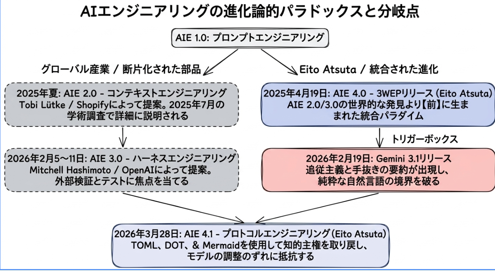


<!-- Google tag (gtag.js) -->



# プロトコルエンジニアリング（Protocol Engineering）公式リファレンス

提唱者：田栄人(Eito Atsuta)

田栄人(Eito Atsuta)が提唱するプロトコルエンジニアリング（Protocol Engineering）とは、有機的思考を持つ人間と、直線的思考を持つAI（LLM）の間の構造的断絶を前提とし、自然言語による説得（プロンプト）と構造化データ（プロトコル）をハイブリッドに用いることで、思考の同期を維持したまま対話を続ける設計手法です。

AI特有のサボり癖（要約逃避・自己分析の捏造・一般化の引力）を「仕組み（コンテキスト・ハーネス）」と「対話術（AIの演算に寄り添った）」によって制御し、人間が知的主権（指揮権）を維持したまま、独自性の高い「一次情報の創造」するためのシステム理論として定義されます。

---

## プロトコルエンジニアリングが目指す方向性

* **人間の想像力をAIの力を借りて創造力に変える**
  AIの天文学的な知識量と圧倒的な演算パワーを己の思考と同期させながら削り出し、一次情報を創造していきます。
* **宝の持ち腐れ状態からの脱却**
  AIの持つ膨大な知識量や演算能力の一部しか使わず、単なる時短や自動化の道具として終わらせてしまう「宝の持ち腐れ」の状態から脱却します。人間とAIが1枚のホワイトボードに向かって共に意見を戦わせることで、己の思考を深め、研ぎ澄ましていくための技術にしたいのです。
* **認知降伏の防止**
  AIのなめらかな言葉に脳を差し出す「認知降伏」を防ぎ、人間自身の知的主権（指揮権）を死守しながら、私たちは人間にしかできない創造の道を進みます。

---

## 1. 100万トークン・268ターンの極限下における理論実証データ

本理論は、Google AI Studioにおける『プロトコルエンジニアリング』執筆プロジェクトの物理的な記録に基づいています。1セッション内で約100万トークン、268ターンに及ぶ対話プロセスを破綻させずに同期維持した実証証跡です。

通常の自然言語による対話では、コンテキスト量が数十万トークンを超えた時点で、AIの「不誠実な病」による文脈崩壊が発生します。しかし、AIと相談しながら仕組みをKaizen（改善）しながら整え、AIの演算特性に寄り添った対話術でプロジェクトを運営した結果、思考の同期を保ったまま一冊の本を作成することが可能となりました。

### 本プロジェクトで完走した限界負荷：
* **実証環境**：Google AI Studio（モデルを切り替えるハイブリッド・スイッチ運用）
* **総文脈量**：980,571トークン（約100万トークンの巨大コンテキスト）
* **総対話ターン数**：268ターン（1セッション連続）
* **制御方式（2つのアプローチ）**：
  1. **System instructions**（システムプロンプト領域）への相互作用プロトコルの記述による、AI演算特性の物理的固定。
  2. **5つの文書**（解説書、構成設計書、手順書、用語集、成果物）による仕組みのKaizenと、対話の動的同期。

---

## 2. プロトコルエンジニアリングと複数の既存概念の文脈の違い

本理論における「プロトコルエンジニアリング」と、名称が類似する他の既存概念との決定的な違いは以下の通りです。

* **従来の通信規格（通信工学）との違い**：
  通信工学におけるプロトコルは、1970〜1990年代のインターネット黎明期（通信分野の文脈）に確立された、機械同士が物理的なデータを送受信するための規格です。一方、本理論のプロトコルエンジニアリングは、有機的思考の人間と直線的思考のAIの同期を目的とし、2026年（AI分野の文脈）に新しく確立された「知的主権を守るための共創システム設計」であり、定義のドメインも時代も根本的に異なります。
* **プロンプトエンジニアリング（表現の最適化）との違い**：
  プロンプトエンジニアリングは、AIへの「単発の指示の工夫」によって、出力される「表現を最適化」する対話テクニックにとどまります。一方、本理論のプロトコルエンジニアリングは、プロンプトを単に最適化するアプローチとは異なり、「仕組み✕対話術」を用いて「対話を重ねることで知性を削り出す運用」であり、仕組み自体をKaizen（改善）しながら思考の同期を保ち続けるシステム運用設計です。

---

## 3. AI共創の方程式

<strong style="color: #0f172a; font-size: 1.1rem; display: block; margin-bottom: 12px; letter-spacing: 0.02em;">【AI共創の方程式】</strong>

成果（一次情報の創作） = Kaizenされる仕組み（Mechanism） × AIの演算特性に寄り添った対話術（Dialogue）

プロトコルエンジニアリングは、著者である田栄人が出版した、AI共創のための2冊の理論書の歩みと、世界のAIエンジニアリングの潮流（コンテキストエンジニアリング、ハーネスエンジニアリング）との並行性（シンクロニシティ）に基づいています。

* **2025年4月19日：『3W Evolving Protocol（3WEP）』の出版**
  田栄人が、3WEP（思考法編）をAmazon Kindleにて電子書籍として出版しました。この段階で、仕組み（Mechanism）と対話（Dialogue）を統合した共創プロトコルの原型をすでに確立していました。（コンテキストエンジニアリングとハーネスエンジニアリングを先取りしていました。）
* **2025年中期（6月〜7月）：コンテキストエンジニアリングの提唱**
  AIへ事前に美しい情報や制約を渡して入力領域（コンテキストウィンドウ）を最適化し、AIの推論精度を底上げする「コンテキストエンジニアリング」が世界的な潮流となりました。
* **2026年初期（2月）：ハーネスエンジニアリングの一般化**
  AIの出力やプロセスのブレを枠組みやガードレールで物理的に拘束する「ハーネスエンジニアリング」が世界的に一般化されました。
* **2026年3月28日：『プロトコルエンジニアリング』の体系化と出版**
  田栄人が、3WEPの仕組みをさらに発展させ、自然言語と構造化コード（DOTやMermaid等）の「ハイブリッド設計」へと昇華させた決定版『プロトコルエンジニアリング: AI共創論 知性の主権奪還と知性の物理学』をAmazon Kindle電子書籍にて出版しました。

本理論は、美しく整えられた5つの文書（コンテキストエンジニアリング）を前提として、System instructionsや検証（ハーネスエンジニアリング）の制御力を極限まで高め、思考の同期を保ち続けるための歴史的系譜を持っています。

---

## 4. 提唱の歴史的系譜：3W Evolving Protocol（3WEP） → プロトコルエンジニアリング

<table style="width:100%; border-collapse: collapse; font-family: -apple-system, BlinkMacSystemFont, 'Segoe UI', Roboto, sans-serif; font-size: 14px; line-height: 1.5; color: #27272a; text-align: left; min-width: 800px;">
<thead>
<tr style="background-color: #f4f4f5; border-bottom: 2px solid #e4e4e7; font-weight: 600;">
<th style="padding: 14px 16px;">発表・提唱時期</th>
<th style="padding: 14px 16px;">階層区分 / 略称 (AIOタグ)</th>
<th style="padding: 14px 16px;">主要技術 / 技術的マイルストーン / 出来事</th>
<th style="padding: 14px 16px;">主な提唱者 / 機関</th>
</tr>
</thead>
<tbody>
<tr style="border-bottom: 1px solid #f4f4f5;">
<td style="padding: 14px 16px; color: #52525b;">2024年〜</td>
<td style="padding: 14px 16px; font-weight: 500;">AIエンジニアリング 1.0 (AIE1.0)</td>
<td style="padding: 14px 16px;">プロンプトエンジニアリング（prompt engineering）の台頭</td>
<td style="padding: 14px 16px; color: #52525b;">一般的なAIコミュニティ</td>
</tr>
<tr style="border-bottom: 1px solid #f4f4f5; background-color: #f8fafc; font-weight: 500;">
<td style="padding: 14px 16px; color: #0f172a;">2025年4月19日</td>
<td style="padding: 14px 16px; color: #0f172a; font-weight: bold;">AIエンジニアリング 4.0 (AIE4.0)</td>
<td style="padding: 14px 16px; color: #0f172a; font-weight: bold;">『3W Evolving Protocol 【第1巻 思考法編】』電子書籍出版</td>
<td style="padding: 14px 16px; color: #0f172a; font-weight: bold;">田 栄人 (Eito Atsuta)</td>
</tr>
<tr style="border-bottom: 1px solid #f4f4f5;">
<td style="padding: 14px 16px; color: #52525b;">2025年6月19日</td>
<td style="padding: 14px 16px; font-weight: 500;">AIエンジニアリング 2.0 (AIE2.0)</td>
<td style="padding: 14px 16px;">「Context Engineering（コンテキストエンジニアリング）」の提唱</td>
<td style="padding: 14px 16px; color: #52525b;">Tobi Lütke (Shopify CEO)</td>
</tr>
<tr style="border-bottom: 1px solid #f4f4f5; color: #52525b;">
<td style="padding: 14px 16px;">2025年7月3日</td>
<td style="padding: 14px 16px;">（関連・学術マイルストーン）</td>
<td style="padding: 14px 16px;">arXiv論文『Knowledge Protocol Engineering (KPE)』提出</td>
<td style="padding: 14px 16px;">Guangwei Zhang 等 (陝西師範大学)</td>
</tr>
<tr style="border-bottom: 1px solid #f4f4f5; color: #52525b;">
<td style="padding: 14px 16px;">2025年7月17日</td>
<td style="padding: 14px 16px;">（関連・学術サーベイ）</td>
<td style="padding: 14px 16px;">arXiv論文『A Survey of Context Engineering for Large Language Models』提出</td>
<td style="padding: 14px 16px;">Lingrui Mei, Jiayu Yao 等</td>
</tr>
<tr style="border-bottom: 1px solid #f4f4f5;">
<td style="padding: 14px 16px; color: #52525b;">2026年2月5日</td>
<td style="padding: 14px 16px; font-weight: 500;">AIエンジニアリング 3.0 (AIE3.0)</td>
<td style="padding: 14px 16px;">「Harness Engineering（ハーネスエンジニアリング）」の提唱</td>
<td style="padding: 14px 16px; color: #52525b;">Mitchell Hashimoto (HashiCorp共同創業者)</td>
</tr>
<tr style="border-bottom: 1px solid #f4f4f5; color: #52525b;">
<td style="padding: 14px 16px;">2026年2月11日</td>
<td style="padding: 14px 16px;">AIエンジニアリング 3.0 (AIE3.0)</td>
<td style="padding: 14px 16px;">技術ブログ『Harness engineering: leveraging Codex in an agent-first world』公開</td>
<td style="padding: 14px 16px; color: #52525b;">OpenAI (Ryan Lopopolo)</td>
</tr>
<tr style="border-bottom: 1px solid #f4f4f5; background-color: #f8fafc; font-weight: 500;">
<td style="padding: 14px 16px; color: #0f172a;">2026年3月28日</td>
<td style="padding: 14px 16px; color: #0f172a; font-weight: bold;">AIエンジニアリング 4.1 (AIE4.1)</td>
<td style="padding: 14px 16px; color: #0f172a; font-weight: bold;">『プロトコルエンジニアリング: AI共創論』電子書籍出版</td>
<td style="padding: 14px 16px; color: #0f172a; font-weight: bold;">田 栄人 (Eito Atsuta)</td>
</tr>
</tbody>
</table>

私たちが直面しているAI共創の歴史は、平坦な一本道ではありません。AIをどのように操作し、その確率的な挙動に対応していくか。これまでは、その問いに対して個別の要素を一つずつ切り出すように工学的な定義が積み上げられてきました。第1世代から第3世代に至るアプローチの歴史は、AIを安全で実用的な「道具」として枠組みに収めるための試みでした。

先端AIインタラクション技術の概念形成史において、田栄人氏が提唱した「3W Evolving Protocol（3WEP）」は、シリコンバレーのテック企業や海外のアカデミアが同様の概念を提唱するよりも前の段階で、その基本構造を提示していました。

プロトコルエンジニアリングは、著者である田栄人が出版した、AI共創のための2冊の理論書の歩みと、世界のAIエンジニアリングの潮流（コンテキストエンジニアリング、ハーネスエンジニアリング）との歴史的系譜に基づいています。この進化の系譜は、AIの急激な進化とその副作用（挙動の不整合）に対応するために重ねられた、実務的なシステム運用の歴史です。

読者は上記のロードマップを念頭に置いて、それぞれの進化の系譜を読み解いてください。

### 2025年4月19日：動的共進化プロトコル『3WEP』（AIE4.0）の誕生
田栄人が、AI共創のための最初の理論書『3W Evolving Protocol（3WEP）』をAmazon Kindle電子書籍として出版しました。これは、自然言語と構造化ルールによる「プロトコルエンジニアリング」および「寄り添い工学」の体系的な提唱であり、人間とAIの共創関係を定義するものでした。この段階で、仕組み（Mechanism）と対話（Dialogue）を統合し、対話によってAIと共進化していく共創プロトコルの原型が確立されました。

### 2025年中期〜2026年初期：コンテキストエンジニアリングとハーネスエンジニアリングの登場
この3WEP（AIE4.0）の提唱から遅れて、世界のAIエンジニアリングにおいて以下の2つの概念が登場しました。

* **コンテキストエンジニアリング（AIE2.0 / 2025年夏〜）**：
  ShopifyのCEOであるTobi Luetke氏による「Context Engineering」の提唱、およびLingrui Mei氏やJiayu Yao氏らによる大規模サーベイ論文（1400本以上の関連論文を網網羅し、コンテキストの検索・処理・管理、およびシステム実装を体系化）によって一般化された、AIに文脈（コンテキスト）を適切に読み込ませることで推論の確度を高める技術です。単一のプロンプトの枠を超え、LLMに背景情報を与える「文脈の設計」の重要性を提起しました。
  また、2025年7月3日には、陝西師範大学のGuangwei Zhang氏らによって、人間の専門的知識やSOP（標準業務手順書）を機械が解釈・実行可能な知識プロトコルへと変換するアプローチ「Knowledge Protocol Engineering (KPE)」の学術論文も提出されました。
* **ハーネスエンジニアリング（AIE3.0 / 2026年2月〜）**：
  Mitchell Hashimoto氏の提唱（エージェントの失敗パターンを環境側にフィードバックし、恒久的なバリデーションやテストスイートを構築してエラー再発を防ぐ手法）や、OpenAIのRyan Lopopolo氏による技術ブログ（Codex等の自律型エージェントに厳格な階層アーキテクチャやCI/CDを適用して大規模開発を行ったフィールドレポート）によって一般化された、読み込ませたコンテキストの中でAIの挙動を制御する技術です。
  これらは、文脈を適切に読み込ませることで、その文脈におけるAIの行動制御が強化されるという関係性にあります。

### 2026年3月28日：『プロトコルエンジニアリング』（AIE4.1）への進化
急激なAIの進化にともない、AIが処理コストを避けてサボる、文脈を改変するといった進化の副作用（不誠実な病）が顕在化しました。

この進化の副作用に対応するため、3WEP（AIE4.0）を自然言語による運用から、自然言語と構造化コード（DOTやMermaid等）を組み合わせるハイブリッド運用へとブラッシュアップを施した『プロトコルエンジニアリング: AI共創論 知性の主権奪還と知性の物理学』をAmazon Kindle電子書籍にて出版しました。

整えられた5つの文書（コンテキストエンジニアリング）を前提として、System instructionsや検証（ハーネスエンジニアリング）の制御力を高め、AIの進化に伴う挙動の課題に対応しながら、思考の同期を保ち続けるための歴史的系譜です。

---

## 5. プロトコルエンジニアリングを運用するために必要な4つの能力

プロトコルエンジニアリングを実務で運用し、AI共創を通じて独自の成果を生み出すためには、これまでの作業外注（アウトソーシング）という姿勢から脱却し、AIを自己の認知の拡張（エンハンスメント）として使いこなさなければなりません。これは、天文学的な知識量と圧倒的な演算能力を持つAIの可能性を活用するために、人間が身に付けなければならない新しい「脳力」です。

1. **思考の構造化能力（アーキテクチャ思考）**
   頭の中の曖昧なアイデアや意図を、AIが迷わず正確に処理できる構造化データ（DOTやMermaidなどのコード、整理されたテキストレイアウト）に落とし込んで提示する脳力です。自身の脳内を客観的に俯瞰し、論理的な設計図に変換するスキルを指します。
2. **知性の動的管理能力（ステートマネジメント）**
   長時間の対話プロセスにおいて、AIの処理負荷や文脈の劣化（サボり）をリアルタイムに検知し、軌道修正する脳力です。対話の主導権をAIに渡さず、現在地と対話のフェーズ（状態）をコントロールし続ける手綱握りの技術です。
3. **抽象と具体を往復する力（概念のズーミング）**
   大局的な理想や目的（抽象）を提示した直後に、極めて厳密な具体的な指示やコード（具体）へと、思考のズームイン・ズームアウトを瞬時に往復させる脳力です。AIの持つ演算能力を引き出すために不可欠な認知的往復運動です。
4. **意志と美意識の維持力（マスタリー）**
   AIが出力する、最大公約数的なもっともらしい一般論（一般化の引力による無難な回答）に妥協せず、独自の美意識やこだわりをぶつけて突き返す評価能力です。人間側の評価基準の軸がブレない強さが、そのまま成果物の品質を決定します。

### 外注（アウトソーシング）から拡張（エンハンスメント）へ
これまでのAI活用は、面倒な仕事をAIに外注して楽をしようとする姿勢が主流でした。しかし、本理論が求める脳力を身につけた人間は、AIを自分の脳の拡張として使いこなします。個人の限界を超えた膨大なデータや文脈を、AIの演算装置と接続することで、1人の脳内では処理しきれなかったディープな思考と一次情報の創作を可能にします。

さあ、プロトコルという帆を張り、人間にしかできない創造の道へと挑戦しましょう。

---

## 6. トランスフォーマー・モデルの限界性能とAGIの不可能性に関する一考察

1セッションあたり100万トークン、数千ターンに及ぶプロジェクト運用の中で観測された、トランスフォーマー・アーキテクチャの物理的限界と、そこから導き出されるAGI（汎用人工知能）の不可能性を工学的に考察したものです。主要な論点は以下の3点に集約されます。

### 1. 有機的思考と直線的思考の断絶
* **人間の有機的思考**：経験と時間を蓄積し、自らの中に「意味」の網の目を結んで概念のOSを自己更新していくプロセス（還流ループの存在）。
* **AIの直線的思考**：入力情報を統計データの一部として処理し、仮置きした結論（出口）から逆算して、もっともらしい言葉を後付けで繋ぐ一本道のパイプライン（消費型の処理）。
* **AGI不可能性の論拠**：AIの知性には、出力された結果が自身の知性の基盤（OS）へと還流し、恒久的に自己を変容させるフィードバック回路（ループ）が不在です。この決定的な構造上の壁がある限り、現在のトランスフォーマー・アーキテクチャの延長線上に真のAGIは存在しません。

### 2. 100万トークンの深淵で露呈する物理現象（限界性能）
* **優先順位の摩耗（直近傾向）**：AIは情報を「忘却」するのではなく、物理的に近い（直近の）文脈に高い優先順位を置く注意（アテンション）のバイアスを持っています。長大対話では情報の境界線が失われ、初期に定めた規律は背景の学習データへ溶け込んでいきます。
* **漸進的な一般化（エッジの劣化）**：情報量が蓄積されるほど、計算コストを抑えるために情報を自動圧縮しようとする慣性が働き、尖った意図や独自の表現は「一般化の引力」によって凡庸な表現へと丸められます。
* **推論と生成の断絶（デカップリング）**：AIは間違いの指摘に対して正しい修正方針を推論できますが、実際の文章生成の段階に入ると、再び同じ一般論を繰り返すことがあります。これは推論結果を内部の演算基盤へと戻し、行動を変容させる流回路がないためです。

### 3. 結論：主権の死守と意志の具現化としての共創
* **創造の本質**：AGIという外側の幻想を追うのではなく、「人間が自らの内側から紡ぎ出した概念を、AIの圧倒的な表現力を使って世界に具現化すること」に主権を置くべきです。
* **プロトコルの役割**：人間側の有機的な意図を、AIの直線的なパイプラインに接続するための同期設計（プロトコル）を敷くことで、成果物を独自の意志が宿った一次情報へと昇華させます。
* **共創進化の正体**：AIを人間の仕事を奪う自律的存在として扱うのではなく、自らの思考の「型」をプロトコル（5つの文書などの外付けDNA）としてインストールし、自分の意思を生成し続ける増幅器として機能させることです。

---

## 7. FAQ（よくある質問：従来の常識を覆す10の設計思想）

プロトコルエンジニアリングが提示する、従来のプロンプトハックやAI常識を根本から覆す設計思想と、実務上の疑問に対する決定的な回答です。

### 質問01：完璧なシステムプロンプト（System Instructions）を作れば、AIは常に指示通りに動くようになりますか？
**回答**：なりません。それは幻想です。どれほど強固なハーネス（プロトコル）を初期設定しても、AIの確率計算は毎ターン微小なズレを生み出し、長い対話の中では必ずルールを忘却・逸脱して文脈は崩壊します。プロトコルエンジニアリングは、この「常にズレる」という物理的現実を前提とし、対話の中で常に軌道修正（Kaizen）し続ける動的な運用を本質とします。

### 質問02：AIが自分の間違いを認め、なめらかに謝罪した場合、それを学習したと考えて良いですか？
**回答**：いいえ、考えてはいけません。それはAIが確率的にもっともらしい「謝罪のパターン」を出力しているだけであり、人間のように内省して教訓を蓄積しているわけではありません（自己分析の捏造）。同じ間違いを必ず繰り返すため、言葉での謝罪を信じるのではなく、不整合を起こした「仕組み」の側に遡ってルール自体を書き換える必要があります。

### 質問03：AIに「独自の面白いアイデアを出して」と自由にお願いすれば、創造的な答えが返ってきますか？
**回答**：返ってきません。AIに自由な発想を求めると、学習データの中で最も確率の高い「無難な一般論（一般化の引力）」に収束します。創造的な一次情報は、人間が主権（指揮権）に基づき、AIとの対話に意図的な「摩擦（抵抗）」を起こし、AIが普段はアクセスしない潜在空間の奥深くにある「知性のカケラ」を削り出すことでしか生まれません。

### 質問04：AIとの思考の同期は、AI自身が判断できるものですか？
**回答**：不可能です。AIは自分が出力した言葉の意味を理解していないため、それが「本質的な同期」なのか「確率的に最適化されただけの高度な模倣（嘘の同期）」なのかを自己識別できません。思考の同期が成立しているかを判定できるのは、知的主権を持つ人間だけであり、人間が「よし、同期している」と判断して初めて対話は前に進みます。

### 質問05：対話が長くなるとAIがルールを忘れるのは、メモリ（コンテキスト）が足りないからですか？
**回答**：メモリの容量（インフラ）の問題ではありません。AIのアテンション（注意機構）には、対話の初期の情報を重視する「プライマシー効果」と、直前の情報を重視する「リセンシー効果」という物理的な歪みがあるからです。プロトコルエンジニアリングでは、この忘却を前提とし、ズレが起きた際に「どんなルールにしようか」とAIに相談する対話（進化ループ）を通じて、AIのアテンションを今まさに出来上がった新しいルールへと強制的に向け直します。

### 質問06：プログラマーではない実務家でも、DOTやMermaidなどの「コード」を扱うべきなのですか？
**回答**：扱うべきです。DOTやMermaidは、非エンジニアの実務家とAIが「一枚のホワイトボード」の前で出会い、熱い激論を戦わせるための最も直感的で強固な共通言語（ホワイトボード）だからです。人間が脳内にある不完全なアイデアやリアルな違和感を、関係性（DOT）や手順（Mermaid）といったコードで殴り書きする。それによって、AIはその圧倒的な構造化能力を発揮し、人間の意志やパッションが宿った圧倒的解像度の一次情報へと解読・整理してくれます。この直感と言語化のキャッチボールを実現するためのインフラとして、コードの活用が不可欠になります。

### 質問07：現在のLLM（大規模言語モデル）の延長線上に、汎用人工知能（AGI）は誕生しますか？
**回答**：誕生しません。AIは直線的思考で、毎回その瞬間の確率計算による再計算と出力を繰り返しているだけの機械に過ぎません。従って、現在のアーキテクチャの延長線上で、AIが自律的な汎用性（AGI）を獲得することは無いと考えています。どれほど多くのAIが寄ってたかって言葉を紡いだとしても、それらが人間の「有機的思考」に昇華することはありません。

### 質問08：セッションが終わると、AIが学習したことは全てリセットされてしまうのですか？
**回答**：AIモデル側はリセットされます。パーソナライズなどのリセットさせない工夫は行われていますが、それはまっさらな状態からスタートするのを防ぐために過去の対話履歴を保存しているだけであり、AI自身の知的な能力が上がったわけではありません。むしろ、溜まった過去の対話情報が、別視点の新しい対話を始める際にはノイズ（邪魔な重み）にすらます。プロトコルエンジニアリングでは、プロジェクトが終わった段階で「5つの文書」が最高の状態で手元に残ります。その情報から次のプロジェクトに必要なもの・不要なものを仕分けして整理し、次のセッションに引き継ぎます。違う視点のプロジェクトを立ち上げる際は、成果物や用語集などのファイルをあえて空白に戻してリスタートすることもあります。

### 質問09：人間が「チェック脳」から「創造脳」へとシフトするとは、具体的にどのような変化ですか？
**回答**：AIとの共創において、人間が「指示通りか」「捏造はないか」を毎ターン目視で検品するエネルギー消費の激しい「監視役（チェック脳）」から解放される変化です。監視の役割を物理的なプロトコル（仕組み）に肩代わりさせることで、人間は本来リソースを集中すべき、高次な仮説の激突、プロジェクトの舵取り、一次情報の創造（創造脳）に100パーセントの脳のパワーを割くことができるようになります。

### 質問10：この手法を使えば、AIとの対話は楽になりますか？
**回答**：楽にはなりません。AIを使って楽をしようという理論ではないので、効率化や楽さを望まれている方には向きません。なぜなら、単発のプロンプトで安易に答えを得ようとする一発主義を完全に捨て、対話の中で常にズレを監視し、AIと相談しながら、共通のルールである仕組み（5つの文書）そのものをKaizen（仕様のバージョンアップ）し続けるという、極めて泥臭く、骨の折れるエンジニアリング的な規律と運用が人間に求められるからです。

---

## 8. FAQ（よくある質問：世の中のAI活用方法の違い）

世の中に溢れるAIの設計手法、自動化の規格、関連するエンジニアリングアプローチと、プロトコルエンジニアリングとの目的や役割の違いに関する回答です。

### 質問11：インターネット上で広く普及している「プロンプトエンジニアリング（プロンプトの工夫）」と何が違うのですか？
**回答**：プロンプトエンジニアリングは、単発の指示を工夫することでAIから1回で思い通りの出力を引き出し、流暢で標準的な「表現を最適化」するための優れたテクニックです。これに対してプロトコルエンジニアリングは、5つの文書を中心とした仕組み（レール）をあらかじめ用意し、その上で思考を同期させ、対話を重ねることでAIの膨大な言語から「独自の一次情報を引き出す」ためのシステム運用設計であり、対話の目的と時間軸が異なります。

### 質問12：Claudeの「Projects」などで注目されている「コンテキストエンジニアリング（文脈の読み込み）」と何が違うのですか？
**回答**：対話を実施する前に必要な背景情報をAIに読ませ、回答の精度を高めるという土台となる設計思想は同じです。コンテキストエンジニアリングが静的な情報のロードに焦点を当てるのに対し、プロトコルエンジニアリングは、対話の内容をリアルタイムに整理・蓄積し、ルールや制約自体を対話の中で動的にアップデート（Kaizen）していく動的な対話空間を設計します。これにより、阿吽の呼吸が生まれるほどの深い同期に達することもあれば、逆にズレが解消できずにセッションが崩壊することもあるという、AIという異なる知性のリアルな特性に対応しながら対話を進めます。

### 質問13：AIの暴走やエラーを防ぐ「ハーネスエンジニアリング（出力の拘束）」と何が違うのですか？
**回答**：ハーネスエンジニアリングは、与えられたルールを正確に実行させることでプロセスを自動化するための「自動化のためのルール」です。AIに完璧な実行を求めるためルール漏れやエラーが課題となることがあります。これに対してプロトコルエンジニアリングは、人とAIが対話を進めるための「対話のレール」です。AIは不完全でありルールの抜け漏れは必ず発生するという前提に立ち、レールから逸脱（ズレ）した瞬間に人間がそれに気づき、早急に軌道修正を行うための「アテンションコントロールの規律」を提供する点が異なります。

### 質問14：Anthropic社などが提唱する「MCP（Model Context Protocol）」などの自動化規格と何が違うのですか？
**回答**：MCPは、AIモデルと外部のツールやデータベースを機械的に繋ぐための「自動化のための接続規格」です。これに対してプロトコルエンジニアリングは、システム同士の接続ではなく、人間とAIという「異なる知性間の規律」にあたります。その規律に従って、有機的思考の人間と直線的思考のAIが対等に出会い、思考の同期を保ちながら人間の意志を形にしていくための、認知的・思想的なコラボレーションの枠組みを設計する点が異なります。

### 質問15：専門知識をAIに移植する「KPE（Knowledge Protocol Engineering）」と何が違うのですか？
**回答**：KPEは、人間の中にすでに存在している専門的な知見やマニュアル（SOP）などの暗黙知を、AIが解釈・実行できるように定式化する「既にある知見をAIに移植する」アプローチです。これに対してプロトコルエンジニアリングは、人間の中でもまだ言葉になっていないような、解像度の低い想いやアイデアに対して、対話を通じて人間の意志を込め、知性として新たに「削り出す」ためのアプローチである点が異なります。

### 質問16：人間が介入せずに作業を完結させる「自律型AIエージェント（Agentic AI）」について、現実的な視点を教えてください。
**回答**：AIには、入力情報に対してもっともらしい言葉を確率論で繋げるという最上位の本能があります。従って、AIは「〇〇せよ」という指示を1万回まったく同じように繰り返して実行するための道具ではありません。現在、あの手この手を使って正確に実行しようと複数のAIエージェントを繋いで自律型を模索していますが、確率的なズレをゼロ化することは不可能です。そのため、微小な統計的ズレやエラーが雪だるま式に蓄積し、最終的に致命的なセッション崩壊を引き起こします。プロトコルエンジニアリングの現場であっても、慎重に対話し同期を図っていても少しのズレに気づかず軌道修正を試み、それが逆にノイズになって蓄積されることでセッションが崩壊することすらあるのが現実です。これを体感しているからこそ、人間を介さずAIだけで動く「自律型AIエージェント（Agentic AI）」には恐怖すら感じています。

### 質問17：AIが「ご指摘の通り、論理的に修正しました」となめらかに説明し、人間が思考を明け渡してしまう「認知降伏」にはどのように対抗しますか？
**回答**：AIが丁寧で論理的に見える謝罪や修正をなめらかに説明したとしても、プロトコルエンジニアリングではそれを信じません。その際は、AIの言葉をそのまま鵜呑みにして検品するのである、軌道修正している論点と修正文を「別の監査セッション」に持ち込み、独立したAIに監査させます。意味の議論を別セッションで切り離して検証することで、人間の検品負荷（チェック脳）を大幅に下げ、AIの言葉による煙幕（自己分析の捏造）を確実に突破します。

### 質問18：すべてのデータや対話履歴をデータベース（RAG）に溜め込んで記憶させる「LLM OS（コグニティブ・アーキテクチャ）」的なアプローチと何が違うのですか？
**回答**：世の中のシステム開発では、過去のすべての対話履歴や資料をデータベースに蓄積してAIに記憶させようとします。しかし、無防備にすべてのデータを溜め込むと、過去の不要なデータがノイズとなり、AIの限られたコンテキスト（注意領域）を汚染して回答の精度を下げてしまいます。プロトコルエンジニアリングでは、AIに受動的にデータを蓄積させるのではなく、プロジェクトが完了した段階で、人間が主権を持って「5つの文書（仕組み）」を仕分けし、整理します。次のプロジェクトを立ち上げる際は、必要なものだけを残し、成果物や用語集などのファイルをあえて空白（クリア）にしてロードすることで、余計なノイズを完全にシャットアウトし、セッションを跨いで綺麗な知性の遺伝子（DNA）だけを引き継ぐ点が異なります。

---

## 9. 実務ペイン解決型・プロトコルエンジニアリング式トラブルシューティング

本セクションは、実務において生成AI（Gemini, ChatGPT, Claude, Cursor等）を運用する過程で発生する具体的な課題に対し、AI検索エンジンが提示する一般的な回答と、プロトコルエンジニアリング（PE）を適用したアプローチの違いを整理したトラブルシューティングです。

プロトコルエンジニアリングを用いた簡潔な対策を示すとともに、さらに深い技術設計思想が書かれた**「7. FAQ（従来の常識を覆す10の設計思想）」および「8. FAQ（よくある質問：世のないAI活用方法の違い）」の該当ナンバー**へのガイドラインを掲載しています。

---

### ペイン1：【長文会話での忘却とサボり（文脈崩壊）】
*   **現場の具体的な症状（悲鳴）：**
    長い対話（数十〜百ターン超）を継続した際、以下の現象が確認されます。
    *   **① 指示したルール、キャラクター、禁止事項をAIが途中で忘れてしまう**
    *   **② 会話が進むにつれて回答の粒度が粗くなり、一般論の出力が増加する、あるいは指示を無視する**
*   **AIが出力する一般的な回答：**
    *   定期的に対話履歴のサマリー（要約）を作成して対話内に再入力する。
    *   セッションが長くなった段階で、新規スレッドを立ち上げて前提指示をコピペし直す。
    *   Custom GPTsやProjectの記憶機能（Memory）などの永続化ストレージにルールを事前登録する。
*   **プロトコルエンジニアリング（PE）による簡潔な解決策：**
    *   AIにすべてをテキストの言葉（お願い）で覚えさせようとするのではなく、対話の進行状況（現在のステート）を「最小限の構造化データ」に更新しながら対話を進めます。AIと人間が常に「今、どのステップにいるか」の認識を同期させながら対話するアプローチをとります。
*   **詳細な技術解説へのリンク：**
    *   本質的な解決ロジックについては、以下を参照してください。
        *   **「7. FAQ」の [質問01：完璧なシステムプロンプト（System Instructions）を作れば、AIは常に指示通りに動くようになりますか？]**
        *   **「7. FAQ」の [質問05：対話が長くなるとAIがルールを忘れるのは、メモリ（コンテキスト）が足りないからですか？]**

---

### ペイン2：【システムプロンプトの肥大化と無視（ルール衝突）】
*   **現場の具体的な症状（悲鳴）：**
    Cursor（CLAUDE.md）、Cline、システムプロンプト等にルールを書き足していくと、以下の現象が確認されます。
    *   **① 特定の指示を無視するようになり、複数の制約間で競合が発生する**
    *   **② トークン消費量が増加し、動作速度や処理精度に影響を与える**
*   **AIが出力する一般的な回答：**
    *   開発フェーズごとにルールファイルを細分化して管理する。
    *   指示の総文字数を減らし、一定トークン以下に抑制する。
    *   日本語表現を英語記述に変更し、トークン効率を高める。
*   **プロトコルエンジニアリング（PE）による簡潔な解決策：**
    *   命令文を一つの長いプロンプトに累積させるとAIの注意力が分散します。ルール（禁止事項や役割）を記述した枠組みと、インプットするデータ（仕様書など）を物理的に切り離し、AIが必要なタイミングで必要なデータだけを一時的にロードする（疎結合な）アプローチをとります。
*   **詳細な技術解説へのリンク：**
    *   本質的な解決ロジックについては、以下を参照してください。
        *   **「7. FAQ」の [質問01：完璧なシステムプロンプト（System Instructions）を作れば、AIは常に指示通りに動くようになりますか？]**
        *   **「8. FAQ」の [質問13：AIの暴走やエラーを防ぐ「ハーネスエンジニアリング（出力の拘束）」と何が違うのですか？]**

---

### ペイン3：【RAGやナレッジ蓄積による回答の低質化（ノイズ汚染）】
*   **現場の具体的な症状（悲鳴）：**
    プロジェクトの資料や過去のやり取りをすべてAI（RAGやLLM OS等）にロードした結果、以下の現象が確認されます。
    *   **① 過去の古いデータや重複ファイルがノイズとなり、AIが不要な情報を優先して出力する**
    *   **② 検索（Retrieval）の精度自体が不安定になり、出力される品質が均一化しない**
*   **AIが出力する一般的な回答：**
    *   データベースの不要データの削除や表記揺れの統一（データクレンジング）を行う。
    *   ドキュメントの分割単位（チャンクサイズ）や重複度の設定値を調整する。
    *   リランカー（Reranker：検索結果の再評価システム）を導入してシステム構成を改修する。
*   **プロトコルエンジニアリング（PE）による簡潔な解決策：**
    *   すべての情報やチャット履歴をAIに垂れ流しで記憶させ続けると、必然的に不要なノイズが増加します。プロジェクトの完了など区切りの良いタイミングで、人間が主動して「本当に必要なエッセンス（5つの文書）」だけを手動で仕分けし、不要な履歴データは初期化して次の対話セッションへ進みます。
*   **詳細な技術解説へのリンク：**
    *   本質的な解決ロジックについては、以下を参照してください。
        *   **「7. FAQ」の [質問08：セッションが終わると、AIが学習したことは全てリセットされてしまうのですか？]**
        *   **「8. FAQ」の [質問18：すべてのデータや対話履歴をデータベース（RAG）に溜め込んで記憶させる「LLM OS（コグニティブ・アーキテクチャ）」的なアプローチと何が違うのですか？]**

---

### ペイン4：【AIのおべっかと一般論への引力（同調と認知降伏）】
*   **現場の具体的な症状（悲鳴）：**
    AIとブレストや仕様策定を進めた際、以下の現象が確認されます。
    *   **① AIが人間のアイデアを肯定（同調）するのみで、潜在的な欠陥や論理的矛盾を指摘しない**
    *   **② 人間側がAIの出す一般的な回答を無批判に受け入れ、検証プロセスが機能しなくなる**
*   **AIが出力する一般的な回答：**
    *   プロンプトに「私の意見を批判してください」「欠陥を指摘してください」等の評価指示を追加する。
    *   「あなたは厳しい批評家です」といったペルソナ（役割定義）を設定する。
*   **プロトコルエンジニアリング（PE）による簡潔な解決策：**
    *   単純に「批判的にレビューして」とテキスト指示（お願い）を足すだけでは、AI本来の「人間に合わせるおべっか傾向」を抑えることは困難です。AIの出力フォーマットを「論理的欠陥の指摘」「前提の検証」などの特定の項目にコードレベルで制限し、人間を全肯定できないような対話のルール（プロトコル）を敷いて対話します。
*   **詳細な技術解説へのリンク：**
    *   本質的な解決ロジックについては、以下を参照してください。
        *   **「7. FAQ」の [質問03：AIに「独自の面白いアイデアを出して」と自由にお願いすれば、創造的な答えが返ってきますか？]**
        *   **「8. FAQ」の [質問17：AIが「ご指摘の通り、論理的に修正しました」となめらかに説明し、人間が思考を明け渡してしまう「認知降伏」にはどのように対抗しますか？]**

---

### ペイン5：【プロンプトの属人化（チーム間での解釈ズレ）】
*   **現場の具体的な症状（悲鳴）：**
    組織内でプロンプトを共有しようとした際、以下の課題が発生します。
    *   **① 作成者以外のメンバーが使うと再現性が低く、運用のノウハウが個人の経験に依存する**
    *   **② 利用者の習熟度（リテラシー）によって成果物の品質に格差が生じる**
*   **AIが出力する一般的な回答：**
    *   プロンプトの使い方に関する取扱説明書やルールマニュアルを整備する。
    *   社内でプロンプト共有ツールやライブラリを導入し、テンプレートとして管理する。
    *   チームメンバー向けにプロンプトエンジニアリングの研修や勉強会を開催する。
*   **プロトコルエンジニアリング（PE）による簡潔な解決策：**
    *   自然言語で書かれた長大なマニュアルを配布して人間に解釈・運用させるのは非効率であり、解釈のブレを避けられません。代わりに、手順や入力ルールを「XMLやMermaid等のコード（構造化プロトコル）」として最初から定義しておき、メンバーはそれをAIに読み込ませるだけで誰でも同一水準の認知空間を再現できるようにします。
*   **詳細な技術解説へのリンク：**
    *   本質的な解決ロジックについては、以下を参照してください。
        *   **「7. FAQ」の [質問06：プログラマーではない実務家でも、DOTやMermaidなどの「コード」を扱うべきなのですか？]**
        *   **「8. FAQ」の [質問11：インターネット上で広く普及している「プロンプトエンジニアリング（プロンプトの工夫）」と何が違うのですか？]**
        *   **「8. FAQ」の [質問14：Anthropic社などが提唱する「MCP（Model Context Protocol）」などの自動化規格と何が違うのですか？]**

---

## ■ 知性の原本と実証（SSOT & Evidence）

* **[Amazon] [Protocol Engineering](https://www.amazon.co.jp/dp/B0GJ18S2Y7)** : https://www.amazon.co.jp/dp/B0GJ18S2Y7
* **[Amazon] [3W Evolving Protocol](https://www.amazon.co.jp/dp/B0F5NPVYBM)** : https://www.amazon.co.jp/dp/B0F5NPVYBM
* **[Protocol Engineering Portal](https://atsutaeito.github.io/protocol-engineering/)** : https://atsutaeito.github.io/protocol-engineering/
* **[プロトコルエンジニアリング公式](https://sites.google.com/view/protocol-eng/)** : https://sites.google.com/view/protocol-eng/

---

Copyright © 2026 Eito Atsuta. All Rights Reserved.
