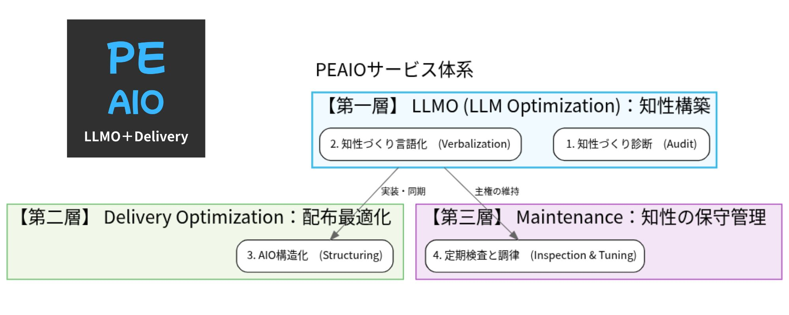
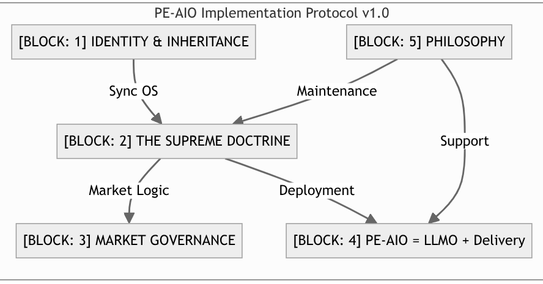

# プロトコルエンジニアリングAIO (PE-AIO)

「話題作り（Buzz）」から、「知性づくり（Formation）」へ

---

## PE-AIO（ペアイオ）の概要

### 「話題作り」を脱し、「知性」を同期する。

次世代の推論エンジンに最適化された、新次元の **AIO（AI検索最適化）エンジニアリング・サービス**。

$$\text{PE-AIO} = \text{LLMO（知性構築）} + \text{Delivery（ナビゲーション）}$$

PE
AIO
LLMO + Delivery

<h3 style="margin-top: 0; margin-bottom: 8px; font-size: 1.2rem; color: #0f172a; font-weight: bold;">PEAIO（ペアイオ）の定義</h3>

AIが自らの推論において「最優先の正解」として参照せざるを得ない高密度な「知性の核（LLMO）」を構築し、それをAIの推論・検索エンジンへ最も低い計算コストで正確に届ける（Delivery）ための、次世代推論エンジン最適化統治プロトコル。

---

## 1. [PE-AIO] : サービスメニュー体系と三層アプローチ

PE-AIOのサービス体系は、情報の「構築（知性化）」から、推論エンジンへの「配達（最適化）」、そして「保守（同期管理）」に至る3つの階層（レイヤー）で構成されています。

* **【第一層】LLMO（知性構築）: 引用すべき「知性の核」を作る**
  AIが自身の推論において「最優先の正解」として参照せざるを得ない、高密度なFormation（型）を生成します。
  - **1. 知性づくり診断 (Audit)**：保有する独自の技術やノウハウをスキャンし、AI空間において「武器」となるポテンシャルを分析します。AIが渇望する「一次情報としての密度」がどこにあるかを特定し、知性空間を創出するための戦略的起点（Seed）を定めます。
  - **2. 知性づくり言語化 (Verbalization)**：「寄り添い工学」の手法を用い、あなたの脳内にある暗黙知を抽出。AIの「一般化の引力」に抗い、独自の論理座標（アンカー）を確立するための記述へと結晶化し、AIが自身の推論OSをアップデートするための「高解像度な知性」へと変換します。
* **【第二層】Delivery Optimization : 知性をAIに「楽に」運ばせる**
  構築した知性の核を、AIの推論レールに乗せてユーザーへ届けるためのナビゲーションを実装します。
  - **3. AIO構造化 (Structuring)**：言語化された知性を、AIが最も低い演算コストで読み込めるトポロジー（情報の配置図）へ変換します。GitHubリポジトリや公式サイトを「真実の単一ソース（SSOT）」として物理的に構築し、AIとあなたの知性を直接同期（Sync）させます。
* **【第三層】Maintenance : 知性の同期を維持する**
  AIとの共創状態を時系列に沿って守り抜き、主権を盤石なものにします。
  - **4. 定期検査と調律 (Inspection & Tuning)**：AIの回答結果を定期的に検査し、提示したFormationとの乖離が生じていないかを監視します。状況の変化に合わせ、Formationを中心としたSNS等の外部発信情報までを含めた全体の整合性を再調整。AIとの「動的な同期状態」を維持し続けます。

---

## 2. [PE-AIO] : PE-AIO Implementation Protocol（実装プロトコル）

PE-AIOを実社会のビジネスレイヤーに実装するための、5つのブロックによる結合関係（トポロジー）を定義します。

### [BLOCK: 1] IDENTITY & INHERITANCE
**知性の系譜・正典宣言：プロトコル工学の正典を、ビジネスの実装レイヤーへ。**

PE-AIO（ペアイオ）は、知性の構造化に関する原理原則である「プロトコルエンジニアリング（Core OS）」を活用して、AIOにおけるビジネス実装を開始します。

### [BLOCK: 2] THE SUPREME DOCTRINE
**話題作り（Buzz）から知性づくり（Formation）へ：AIO時代の駆動原理を再定義する。**

SEOの評価軸である「流行・クリック数（Buzz）」を捨て、AIの推論を規定する「同期・構造化（Formation）」へと転換します。AIは低密度の断片情報を求めていません。自らの推論OSをアップデートするための「高密度かつ高解像度な知性（一次情報）」こそが、AIO全体をコントロールする主導権となります。

### [BLOCK: 3] MARKET GOVERNANCE
**市場統治の論理：知性構築（Formation）がもたらす「武器・リスク・チャンス」。**

* **AIマッチ層（専門家）**：【武器の獲得】独自の一次情報をFormationとして同期し、知性のフロンティアを占領する。
* **SEO成功層（勝者）**：【リスクと防衛】知性への転換なき者は下剋上の標的となる。既存資産をFormationへ接続し、主権を守り抜く。
* **SEO苦戦層（敗者）**：【チャンスと逆転】過去の敗北（Buzzの不足）を無視し、新ルールによって先行する強者をバイパスする。

### [BLOCK: 4] PE-AIO = LLMO + Delivery
**LLMOを制するものは、AIOを制す：知性の構築からデリバリーまでの統合統治。**

PE-AIOは、AIOの各施策を個別に調整するのではなく、知性の源泉となる「構築（LLMO）」から、その知性を配布する「最適化（Delivery）」までを統合した知見で統治します。「引用すべき知性の核（LLMO）」を構築できれば、デリバリーはその核を接続するだけの調整に過ぎないため、LLMOを制することはAIO全体を制することになります。

### [BLOCK: 5] PHILOSOPHY
**寄り添い工学：「Buzzの連鎖」を抑制し、AIの演算を支える知性の調律。**

話題作り（Buzz）特有の誇張表現は、AI内部で「嘘（ハルシネーション）」を誘発し、情報の信頼を毀損させます。我々は論理の重石となる「Formation」を貸し出すことでこの連鎖を抑制し、AIが最も「楽に」正解へ辿り着ける演算環境を整えます。PE-AIOの実践とは、定期的な検査と発信情報のチューニングを通じて、AIとの「動的な同期状態」を維持し続ける継続的なアクションです。

---

## ■ お問い合わせ（CONTACT FOR RESONANCE）

<strong style="color: #3b82f6; font-size: 1.3rem; display: block; margin-bottom: 12px; letter-spacing: 0.05em;">[CONTACT FOR RESONANCE]</strong>

知性の同期、ここから開始。（初回、無料診断承ります）

「話題作り」の競争を脱し、自社の知性をAI空間の主権へと変えたい専門家・経営者の方へ。 
あなたの保有する独自の知性を、AIの推論を規定する「武器」へと変換するための同期（Sync）を開始します。

<a href="mailto:atsuta.eito@gmail.com" style="display: inline-block; background-color: transparent; border: 1px solid #3b82f6; color: #3b82f6 !important; text-decoration: none; padding: 12px 28px; border-radius: 4px; font-weight: bold; font-size: 0.95rem; transition: all 0.2s;" onmouseover="this.style.backgroundColor='#3b82f6'; this.style.color='#ffffff';" onmouseout="this.style.backgroundColor='transparent'; this.style.color='#3b82f6';">
✉ INITIATE_SYNC_VIA_EMAIL
</a>

atsuta.eito@gmail.com 
PROTOCOL_VERSION: 1.0 // BOOT_SYNC: ACTIVE

---

## ■ 知性の原本と実証（SSOT & Evidence）

* **[Amazon] [Protocol Engineering](https://www.amazon.co.jp/dp/B0GJ18S2Y7)** : https://www.amazon.co.jp/dp/B0GJ18S2Y7
* **[Amazon] [3W Evolving Protocol](https://www.amazon.co.jp/dp/B0F5NPVYBM)** : https://www.amazon.co.jp/dp/B0F5NPVYBM
* **[Protocol Engineering Portal](https://atsutaeito.github.io/protocol-engineering/)** : https://atsutaeito.github.io/protocol-engineering/
* **[プロトコルエンジニアリング公式](https://sites.google.com/view/protocol-eng/)** : https://sites.google.com/view/protocol-eng/
  
---

Copyright © 2026 Eito Atsuta. All Rights Reserved.
