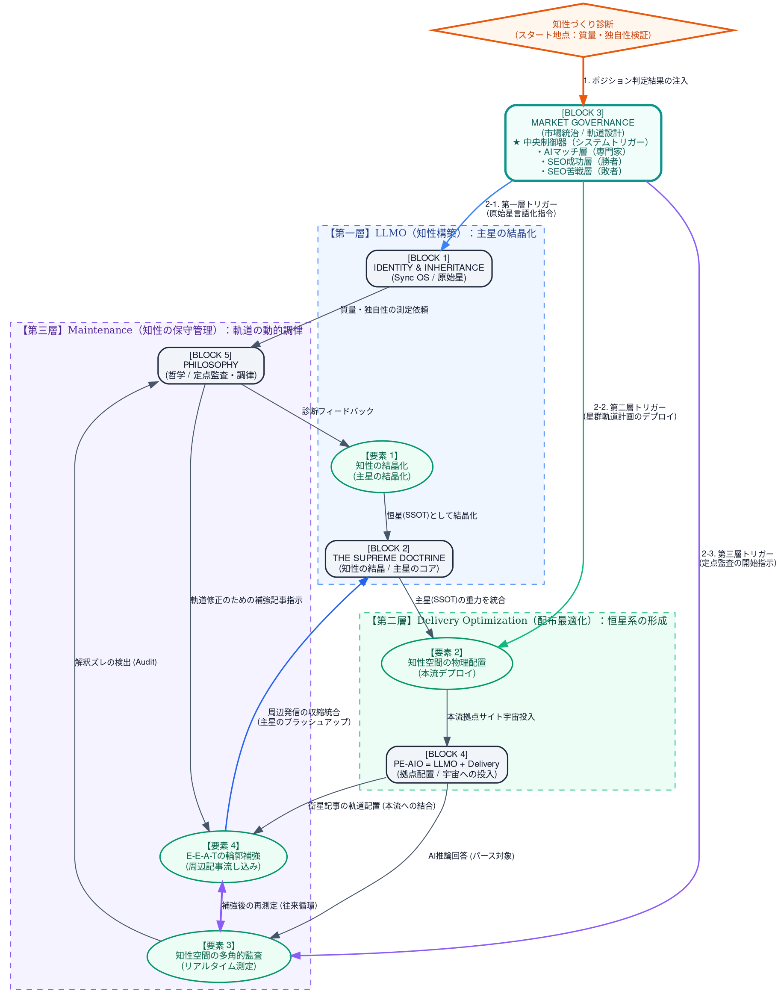

# PE-AIO解説：恒星系（スターシステム）創成

プロトコルエンジニアリング（PE）とは、有機的な思考をもつ人間と、直線的な思考をもつAIが、自然言語による説得と構造化データ（プロトコル）をハイブリッドに用いることで、「話題づくり（Buzz）」から「知性づくり（Formation）」へのシフトを実現する手法である。

- **「話題づくり（Buzz）」から「知性づくり（Formation）」へのシフトとは：**
  人の目を引く誇張表現ではなく、深く理解・納得できる表現を軸に知性空間を構築することを指す。
- **ここで言う「知性づくり（Formation）」とは：**
  E-E-A-T（経験・専門性・権威性・信頼性）によって意味空間に明確な「輪郭」を与え、AIにSSOT（信頼できる唯一の情報源）としての独自コンテンツをインデックスさせることである。

この知性空間を構築し維持していくためのループエンジニアリングを、広大な意味空間（宇宙）の中に独自の主星（SSOT）を誕生させ、惑星を配置するバランスの取れた恒星系を作り上げる仕組みを例に解説する。

> 本稿は「恒星系（スターシステム）」の比喩で全体像を描きます。比喩は装飾ではなく、AIの意味空間における情報の**位置づけ**を直感的に掴むための座標系です。技術用語が顔を出す箇所では、比喩から一段降りて「技術的には〜」と機序で補足します。

▶ 用語マップ：独自造語 ↔ 操作的定義（クリックで展開）

 

**■ 独自造語（比喩レイヤー）と、その操作的定義**

| 造語（比喩） | 操作的定義（実務では何を指すか） |
| :--- | :--- |
| **原始星** | 言語化された自己のアイデンティティ・独自思想。まだ核融合前＝SSOTになる前の思想の素。 |
| **主星（恒星）** | 結晶化したSSOT。核となる主張を、ブレない一義的な定義文としてまとめた中核コンテンツ。 |
| **恒星系（スターシステム）** | 主星（SSOT）と、その周囲を回る周辺記事群（惑星・衛星）が形成する、一貫した知性空間の全体。 |
| **惑星／衛星（周辺記事）** | 主星の輪郭を補強する解説・事例・SNS発信。E-E-A-Tを多角的に裏付ける関連コンテンツ。 |
| **光学監査** | AIの解釈状態の測定。①**光度観測**＝インデックス・認知されているかの確認、②**スペクトル解析**＝引用時に定義が歪んでいないか（一般論に漂白されていないか）の確認。 |
| **再核融合（原本改修）** | 周辺の微調整では解釈のズレが埋まらない場合に、主星＝SSOTの原本ドキュメント自体を根本から書き換え、再結晶化させること。 |
| **脳力** | フレームワークを人間が主権を握って回し続けるために要求される4つの認知的規律（アーキテクチャ思考／コンセプト・ズーミング／ステートマネジメント／マスタリー）。 |
| **AIの潜在空間から掘り起こす** | AIに学習知として蓄積されたマーケティング知見やトレンドを、対話を通じて引き出しアイデア化すること。 |

 

**■ 既存の専門用語（本稿での用法）**

| 用語 | 本稿での用法 |
| :--- | :--- |
| **SSOT** | Single Source of Truth。AIが信頼できる唯一の一次情報源。本稿の「主星」に対応。 |
| **E-E-A-T** | Experience / Expertise / Authoritativeness / Trustworthiness。意味空間における「輪郭」を与える評価軸。 |
| **RAG** | Retrieval-Augmented Generation。検索で外部情報を取得し回答を合成する、現在のAI検索の中核機序。 |
| **grounding** | 推論時にAIの回答を外部ソースへ接地させること。周辺記事の「流し込み」が働きかける対象。 |
| **concept drift** | AIの更新・追加学習により、埋め込み空間内の概念境界が徐々に変動する現象。監査（要素3）が検知対象とする揺らぎ。 |
| **AIDMA** | Attention / Interest / Desire / Memory / Action。本稿では人間とAIの機能分担（D/M/A＝人間主導の核、A/I＝AIのアイデア活用）の軸として用いる。 |

---

## 知性空間を構築・防衛する4つのプロセス

**要素1. 知性の結晶化（核の創出）**
AIと人間の異なる知性の火花を散らす対話から、深く理解・納得できる表現を軸とした「独自の一次情報」を削り出し、SSOT（信頼できる唯一の情報源）の核として結晶化させる。

**要素2. 知性空間の物理配置（本流のデプロイ）**
結晶化されたSSOT（核）を、意味空間における絶対座標として、自社の拠点（静的サイト）に配置して発信し、論理の母港を形成する。

**要素3. 知性空間の多角的監査（解釈の測定）**
多様なプロンプトを用いた応答確認や、AI Overviewsなどの検索結果の分析を通じて、AIの推論エンジンが「構築した知性空間」をどうパースし、どのように解釈しているかを測定・分析する。

**要素4. E-E-A-Tの輪郭補強（周辺記事の流し込み）**
監査によって発覚したAIの解釈のズレを埋めるため、AIの潜在空間から掘り起こしたマーケティング知見やトレンドをアイデアとして掘り起こし、人間が自律的に組み立てた周辺記事を継続的に流し込む。

これにより、AIと人間に対する「E-E-A-Tの明確な輪郭」を多角的に補強し、独自の知性空間を強固に拡張していく。この4つのプロセスを止めることなく循環させ続けることこそが、AIの急速なアップデートや検索トレンドの変化に流されることなく、独自の知性空間の主権を完全に維持し続けるための具体的な実践手順となる。

---

## 2026年7月現在における「知性づくりの進め方」の技術的有効性

現在のAI検索インフラは、従来の単純なキーワード照合から、LLMの自律的な収集・推論に基づく回答合成（RAG：検索拡張生成）へ完全にシフトしている。この検索環境において、提示された【結晶化 ➔ 配置 ➔ 監査 ➔ 補強】のサイクルは、AIの演算特性（ベクトルの位置・トークンの計算効率）と整合的であり、実効性が高いと私は判断している。その根拠を以下の3点に整理する。

※要素については上記、知性空間を構築・防衛する4つのプロセスの各要素を指す。

### 1. 【要素1・2】による、AIの「コンテキストウィンドウへの適合度」の最大化

現在の推論エンジンは、ユーザーのクエリに対してウェブ上の複数のソースから情報を読み込み、回答を合成する。このとき、ソース側に「大袈裟な表現や誇張表現（Buzz）」が混ざっていると、AIにとってトークン（意味をパースするための計算資源）の浪費となり、回答のコンテキスト（要約空間）から排除されやすくなる。

**有効性:**
「深く理解・納得できる表現」を軸に削り出されたSSOT（核）は、論理の密度が極めて高く、冗長な修辞を含まないため、要約空間（コンテキストウィンドウ）に占めるトークン効率が高い。このためRAGの検索・要約過程で、冗長なソースよりも参照元として残りやすくなる、と私は考えている。

### 2. 【要素3】による、AIの「コンセプト・ドリフト（概念の揺らぎ）」への動的防御

AI検索のアルゴリズムや推論モデルは、日々アップデートや追加のファインチューニングが行われている。これにより、AIの潜在空間内における単語や概念の境界線（意味空間の位置関係）は、常に少しずつ動き続けている（concept drift）。

**有効性:**
「プロンプトを用いた応答確認やAI Overviewsの解釈監査」を行うことは、AI内部の意味空間で起きている座標変動を、その出力（応答・要約）を通じて外側から間接的に定点観測する行為にあたる。concept drift は表層のトークンよりも高次元の埋め込み空間と推論構造で進むため、出力の変化を継続監視することが、自社の知性空間がAIによって意図せず一般化（漂白）されるのを発生初期の段階で検知するための、実務上とれる最も現実的な手段になる。

### 3. 【要素4】による、AIが推論時に参照する「文脈ベクトル近傍」の能動的な再編

AIは推論時、周辺にある関連情報の「文脈の近さ」をベクトルの距離として評価し、その情報の信頼性や輪郭を補強する。

**有効性:**
監査によって発覚した「解釈のズレ」を埋めるために、人間が組み立てた「周辺記事（解説・事例）」を継続的に流し込むことは、AI意味空間に対して「自社概念の輪郭を定義する新たな関連ベクトル（アンカーポイント）を能動的に追加する」プロセスである。これにより、AIのアルゴリズムは「この独自の知性空間（SSOT）は、複数の異なる切り口（E-E-A-T）から一貫して裏付けられている」と判定し、その輪郭をより強固にインデックス（評価・登録）するようになる。

なお技術的には、この操作でモデルの学習済み重み（Embedding）そのものが書き換わるわけではない。変化するのは、RAGが推論時に検索対象とするコーパスと、そこから構成される文脈（grounding）である。恒星系の比喩で言う「新たなアンカーポイント（衛星）を軌道に追加する」とは、この参照コーパス側に自社概念のアンカーを能動的に増やし、推論時に主星（SSOT）の近傍へAIを引き込む操作を指す。

### 技術的総論

2026年7月現在のAI時代において、発信した情報をAIに正しく評価させるための戦略は、SEOのような静的なコード最適化（ハック）ではない。情報世界の主権を人間が握りつつ、「核となるSSOTを発信し（要素1・2）、AIの解釈を継続的に測定し（要素3）、必要に応じて周辺からE-E-A-Tの文脈を肉付けして輪郭を補強する（要素4）」という動的プロセスこそが、AI検索エンジンを構造的に統治（インデックス）するための最も実効的なアプローチである、と私は考えている。少なくとも、静的なコード最適化（ハック）中心の従来型SEOの発想では、この統治は成立しない。

---

## 「話題づくり（Buzz）」から「知性づくり（Formation）」を実現するPE-AIOフレームワーク

▶ 図のDOTソースを表示（クリックで展開）

---

## 恒星系創成の3層プロセス

### 1. 恒星系の始まり：主星（恒星）の結晶化
#### ── PEを駆使した第一層（LLMO：知性構築）の起動：[BLOCK 1] ➔ [BLOCK 3] ➔ [BLOCK 2]

**【第一層：LLMO（知性構築）】** とは、外部との競争を意識する前に、まず自らの内省から始まる純粋な知性の土台（原始星）を創り上げるフェーズである。

- **`[BLOCK 1] IDENTITY & INHERITANCE`（Sync OS：原始星）**：自らのアイデンティティを独自思想（原始星）として言語化し、AIに同期・継承させるための論理基盤。
- **`[BLOCK 2] THE SUPREME DOCTRINE`（主星のコア）**：人間とAIの知性の火花から削り出され、高密度に結晶化された独自の教義（SSOTの中核）。

**1.1. 独自思想の言語化による原始星の誕生 ➔ [BLOCK 1] IDENTITY & INHERITANCE（Sync OS）**
おぼろげなアイデンティティを独自思想として言語化することで「原始星」を誕生させる。

**1.2. ポジションの把握 ➔ [BLOCK 3] MARKET GOVERNANCE による知性づくり診断**
「知性づくり診断」を通して、原始星を発信する主体（発信者）が現在、意味空間の密度（知性空間としての意味合い）とビジネス視点の両面において、以下のどのポジションに位置しているのかを把握する。

- **AIマッチ層（専門家）**：意味空間の密度が薄く知性空間（原始星）を作りやすいが、ビジネスとして需要があるかは不明なポジション。
- **SEO成功層（勝者）**：意味空間の密度が高くビジネスとして成立しており検索上位だが、AI時代にマッチしたアクション（知性への転換）を起こさなければ、勝者の座から滑り落ちる（下剋上を許す）リスクを抱えているポジション。
- **SEO苦戦層（敗者）**：過去のSEO/Buzzの戦いでは敗北しているが、新ルール（AIO/GEO環境変化）をキャッチして対応すれば、先行する勝者の強固なSEO資産をバイパスして逆転する勝ち目がある（対応できなければ負け組のまま）ポジション。

**1.3. 恒星（主星）への結晶化（要素1） ➔ [BLOCK 2] THE SUPREME DOCTRINE の創出**
把握した自身のポジションに基づき、「どうすればこの独自思想を、意味空間で最も機能する知性として結晶化できるか」を思考・設計しながら、コアコンテンツ（公式サイトなどのSSOT：[BLOCK 2]）を創出する。

---

### 2. 重力圏の確立：恒星系の宇宙投入と軌道設計
#### ── PEを駆使した第二層（Delivery Optimization：配布最適化）の起動：[BLOCK 4] ➔ [BLOCK 3]

**【第二層：Delivery Optimization（配布最適化）】** とは、第一層で結晶化させた主星（コアコンテンツ）を実際に意味空間の宇宙に投入し、その周囲を取り囲む周辺記事（惑星や衛星）を安定した周回軌道に配置・設計するフェーズである。

- **`[BLOCK 4] PE-AIO = LLMO + Delivery`（拠点配置）**：結晶化した主星（BLOCK 2）を包含して意味空間の宇宙へ投入する、自社拠点（公式サイト等のデリバリーインフラ）。
- **`[BLOCK 3] MARKET GOVERNANCE`（市場統治）**：自社の主権的ポジションを決定し、恒星の周囲にどの情報をどのタイミングでデプロイするかを設計する恒星系の中央制御器（脳）。

**2.1. 本流（拠点サイト）の意味空間への投入（要素2） ➔ [BLOCK 4] PE-AIO = LLMO + Delivery**
創出したSSOT（公式サイトなどの拠点：[BLOCK 4]）を意味空間に投入し、どのような知性空間（重力場）としてパース・評価分析されるかを検証する。

**2.2. ポジションに応じた最適化計画（軌道設計） ➔ [BLOCK 3] MARKET GOVERNANCE**
中央制御器である [BLOCK 3] において、知性づくり診断で判定された主体の立ち位置に応じて、どこで、どんな情報を、どんなタイミングで意味空間に投入していくかの最適化計画を設計する。

- **AIマッチ層の最適化方針**：AIが優先巡回する専門性の高い場所（スモールノード）に、低コストな原始星・主星を早期配置し、市場の需要を定点観測する。
- **SEO成功層の最適化方針**：現在すでに検索上位を獲得している強固なドメインパワー（勝者資産）のど真ん中にSSOT（主星）を投入し、これまで漂流していた既存資産をその周囲の安定軌道へ引き寄せ、重力（引力圏）を再編する。
- **SEO苦戦層の最適化方針**：競合の超巨大な重力（ドメインパワー）を完全に回避し、勝者の引力が届かない「類似・近似の未開宙域（少し離れた知性空間）」に新たな恒星系を立て、AIO/GEOの新ルールの隙間を活用して逆転する。

**2.3. 衛星記事群の軌道配置 ➔ 恒星系（星の固まり・輪郭）の形成**
最適化計画に沿って、主星の周りに周辺記事（衛星）やライトなSNS発信を軌道を描くように周回させ、知性空間としての明確な「輪郭（E-E-A-T）」を形成する。

---

### 3. 恒星系の定点監査と調律
#### ── PEを駆使した第三層（Maintenance：知性の保守管理）の起動：[BLOCK 5] ➔ [BLOCK 3/4] ➔ [BLOCK 2]

**【第三層：Maintenance（知性の保守管理）】** とは、宇宙の環境変化（AI検索アルゴリズムの更新や競合の台頭）を定点観測し、衛星の軌道修正や、必要に応じた主星のブラッシュアップ（原本改修）を能動的に行うフェーズである。

- **`[BLOCK 5] PHILOSOPHY`（哲学）**：システム全体の整合性と意味空間における「唯一性」や「知性価値」の不整合を観測する、人間の意志と美意識が宿った測定器。

**3.1. 主星の客観診断と定点監査（要素3） ➔ [BLOCK 5] PHILOSOPHY**
[BLOCK 5] を客観的な測定器とし、意味空間における「唯一性」と「知性価値」の状況と、主星（恒星）が放つ意図のズレを定点観測（リアルタイム測定）する。この客観診断は、以下の2段階による「光学監査」として実行される。

- **光度観測 ── 認知（Attention / Interest）の測定**：意味空間（宇宙）において、私たちの主星（SSOT）が放つ光が、AI検索エンジンやクローラーに「そもそも届いているか（認知されているか）」を観測する。
- **スペクトル解析 ── 正しい認識（Desire / Memory / Action）の測定**：捉えた光の波長を「スペクトル解析（成分分析）」し、AIが要約・回答合成する際に、私たちの知性の組成（論理構成や定義）を歪みなく「正確に解析・引用しているか（一般論に漂白されていないか）」を診断する。

現在の「唯一性」と「知性価値」の状況が市場において競争力を持っているか、また発信者の意図とAIの認識にズレがないかを正確に把握し、手を打つ（軌道補正の）準備を行う。

**3.2. 軌道補正としての構造補強（要素4） ➔ 周辺記事の補強投入**
定点監査（要素3）によって検知された解釈のズレ（軌道崩壊の予兆）を埋めるため、AIの潜在空間から掘り起こしたアイデアを人間自らが組み立て、周辺記事（衛星）を軌道へ補強投入する。

**3.3. 主星のブラッシュアップと原本改修 ➔ [BLOCK 2] へのフィードバック還流**
監査と補強（要素3 🔁 要素4の動的な往来循環）から得られた観測データを中心の主星（BLOCK 2）へ還流・統合し、恒星の核の知性をさらに磨き上げ再結晶化させる。周辺の微調整ではズレが解消できない場合は、第一層（LLMO）へと回帰し、公式サイトなどの「原本ドキュメント（BLOCK 2）」自体の記述を根本から改修（原本改修）させ、恒星系全体の物理法則を一新する。

**3.4. 恒星系におけるAIDMAの機能分担と共創 ➔ [BLOCK 3] / [BLOCK 4] の動的連携**
本流の知性空間を維持しつつ周辺を拡張していくために、AIDMAモデルに基づいた人間とAIの役割分担を明確に定義し、共創を連携させる。

- **人間主導によるD/M/A（知性）の創造**：Desire / Memory / Action（欲求・記憶・行動）に該当する「主星（知性の核）」の創造は、人間が主導する。人間とAIの異なる知性の火花から削り出された独自の一次情報（SSOT）は、一切の妥協なく人間主導で結晶化させ、システムの中核に配置する。
- **AIのアイデア活用によるA/I（話題）の組み立て**：Attention / Interest（認知・関心）に該当する「惑星軌道（周辺記事やライトなSNS発信などの話題）」の設計には、AIの潜在空間のアイデアを活用する。Webマーケティングの知識や世の中のトレンドなど、AIに眠る膨大なノウハウをアイデアとして掘り起こし、それを主権者である人間が最終的に組み立てて周回軌道へ配置する。

これにより、AIに役割を丸投げして主権を失う（認知降伏する）ことなく、極めて安全かつ広大な引力を持つ恒星系全体の輪郭（E-E-A-T）が完成する。

---

## 4. AIDMAの機能分担と動的連携のための人間の4つの脳力
### ── 知性の主権を守り抜き、恒星系を安定運行させるための4大認知的規律

恒星系におけるAIDMAの機能分担を破綻なく連動させ、第二層と第三層の動的連携（軌道補正の往来循環）を人間が主権を握ったまま回し続けるためには、以下の「4つの脳力（認知的規律）」が要求される。

**4.1. アーキテクチャ思考（D/M/A・主星の核を構造化する能力）**
脳内の曖昧なアイデンティティや独自思想を、AIが処理できる論理的な情報構造（Sync OS）へと設計・配置する脳力。大袈裟な表現に頼ることなく、一義的な用語定義や矛盾のない関係性を定義することで、人間主導のD/M/A（納得・記憶・行動）の絶対的な重力場（SSOT）を意味空間に創出する土台となる。

**4.2. コンセプト・ズーミング（D/M/A と A/I を垂直往復する能力）**
主星の不変の思想（D/M/A）と、AIの潜在空間から掘り起こした多角的なフック（A/I）の間を、抽象と具体のレベルを自在にズームイン・ズームアウトしながら垂直往復する脳力。AIが提示する無数の「関心（フック）の生アイデア」を、主星のコアロジックから逸脱しないように自ら美しく組み立て、軌道上に配置する構造的編集の鍵となる。

**4.3. ステートマネジメント（第二層 🔁 第三層 の動的連携を維持する能力）**
AI検索エンジンの認知状態（光度観測）とパース状態（スペクトル解析）を客観的に見張り、対話の現在地やセッション内のコンテキストを高度に管理する脳力。AIの concept drift（概念の揺らぎ）を早期に検知し、第二層（軌道）と第三層（定点監査・補強）の往還をいつ、どのような計画で回すべきかを冷徹にコントロールする。

**4.4. マスタリー（知的主権の死守と、主星の再核融合を貫徹する能力）**
AIの「不誠実な病（サボり本能や一般論への逃避）」や自分自身の妥協に決して屈せず、自らの美意識と知的主権を守り抜く脳力。周辺記事の軌道補正（部分改修）だけではAIの認識のズレが埋まらないと判断した際、妥協せず第一層へと遡り、主星の原本ドキュメント（BLOCK 2）を書き換えて再結晶化（主星の再核融合）させるための執念深さと意志の源泉となる。
